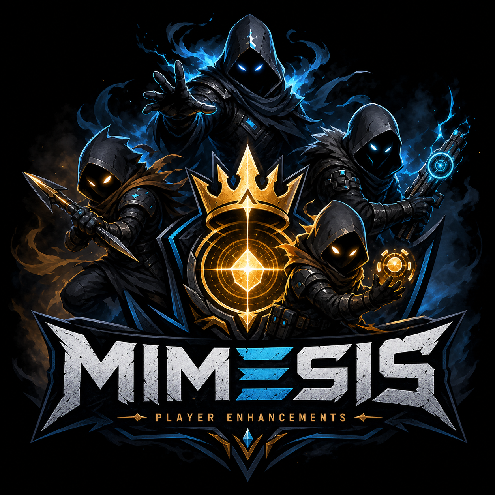
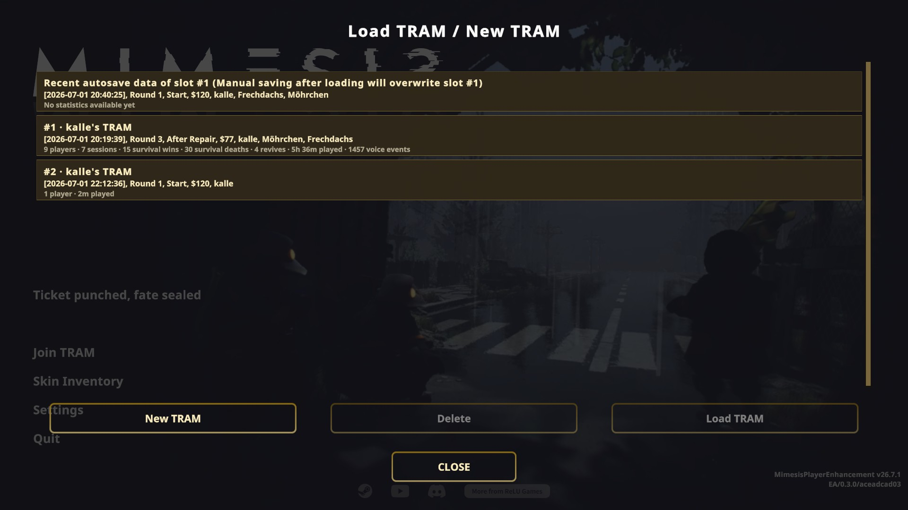

[](https://github.com/Kandru/mimesis-player-enhancements/releases/)
[](#license)
[](https://github.com/Kandru/mimesis-player-enhancements/issues)
[](https://www.paypal.com/donate/?hosted_button_id=C2AVYKGVP9TRG)

# Mimesis Player Enhancement



> [!NOTE]  
> Disclosure: this project is being build with help of AI!

> [!CAUTION]  
> **Alpha — under heavy development.** This plugin is not finished and things may not work as expected. Please report bugs and share feedback via [GitHub issues](https://github.com/Kandru/mimesis-player-enhancements/issues).  
> I am not responsible for any damage, data loss, bans, or other problems that come from using this mod. Mods change how the game runs, and things can break.

Mimesis Player Enhancement is a mod for Mimesis that consolidates and extends a lot of tweaks into one maintained package. Hosts can raise the player limits, expand mimic voice recording and persistence (across game sessions), allow players to join at any time, scale spawns/loot/money to match their needs, randomize dungeons, tune player and mimic behavior, and track session statistics — all from one config file. Clients do not need the mod; only the host does. It also enables the player to use up to 99 different save games within a new UI.

Tested with **MIMESIS 0.3.0** and **MelonLoader 0.7.3**.

## Features

| Feature | What it does | Everyone needs the mod? |
|---------|--------------|-------------------------|
| **More Players** | Raise the 4-player limit (default: 32) | No — host only |
| **More Voices** | Record more player voice lines per context (default: 3000 instead of ~150) | No — host only |
| **Persistence** | Save player voice lines to disk | No — host only |
| **Join Anytime** | Let friends join an active lobby whenever players are not inside a dungeon | No — host only |
| **Extended Save Slots** | Unified main-menu save picker with up to 99 manual slots (vanilla: 3) | No — local UI only |
| **Statistics** | Session stats and leaderboards per save slot | No — host only |
| **Web Dashboard** | Browser UI for players, stats, and moderation | No — host only |
| **Player Announcements** | In-game notifications for dungeon settings, boss spawns, and per-map death stats | No — host only |
| **Spawn Scaling** | Scale mimic/monster spawns by type and player count | No — host only |
| **Loot Multiplicator** | Scale loot quantity and limit item types | No — host only |
| **Money Multiplier** | Scale startup money, round goal, and shop buy prices | No — host only |
| **Dungeon Time** | Extend dungeon shift length by X seconds per player above a baseline (default: +10s per player above 4) | No — host only |
| **Mimic Tuning** | Randomize dead-player mimic possession speak duration and scale post-possession cooldown | No — host only |
| **Player Tuning** | Scale player move speed, stamina (max/drain/regen/delay), and max carry weight | No — host only |
| **Dungeon Randomizer** | Randomize tram dungeon pick, layout flow, map variant, and procedural seed | No — host only |

Inspired by community mods like [MorePlayers from NeoMimicry](https://github.com/NeoMimicry/MorePlayers), [MoreVoices from Risikus](https://thunderstore.io/c/mimesis/p/Risikus/More_Voices/), [MimesisPersistence from JoanR](https://github.com/JoanRLopez/MimesisPersistence), and [MimesisJoinAnytime from Shlygly](https://github.com/Shlygly/MimesisJoinAnytime). Thanks for your ideas and initial work :)

## Install

### Mod manager (recommended)

Install through [Thunderstore](https://thunderstore.io/c/mimesis/p/Kandru/MimesisPlayerEnhancement/) using **r2modman**, **Gale**, or another Thunderstore client. The MelonLoader dependency is pulled in automatically.

### Manual

1. Install the latest [MelonLoader](https://melonwiki.xyz/) on your MIMESIS Steam copy.
2. Download the [latest release](https://github.com/Kandru/mimesis-player-enhancements/releases).
3. Copy the file(s) and folder into your game folder:  
   `<Mimesis Steam folder>/Mods/MimesisPlayerEnhancement.dll`  
   `<Mimesis Steam folder>/Mods/MimesisPlayerEnhancement/*`
4. Start the game once.

If you used the old separate mods (MorePlayers, More Voices, MimesisPersistence, JoinAnytime, MoreMimics), remove them so they do not fight with this one or disable the feature inside this modification.

If you do not trust a pre-built `.dll`, you can [build this mod yourself](docs/BUILD.md) from the source code here on GitHub.

## Screenshot(s)

### Intuitive savegame UI



## Config

After the first launch, the mod creates a config file here:

```
<Mimesis Steam folder>/UserData/MimesisPlayerEnhancement.cfg
```

You can edit it anytime. The game reloads the file while running, but **most changes only fully apply after a restart**. Some settings may not update correctly until you quit and start again.

Settings are grouped into TOML sections:

- **`[MimesisPlayerEnhancement]`** — global options not tied to a single feature
- **`[MimesisPlayerEnhancement_FeatureName]`** — one section per feature (e.g. `[MimesisPlayerEnhancement_MorePlayers]`)

Each feature section has its own master toggle plus feature-specific options. The web dashboard can edit global defaults and per-save-slot overrides.

**Full config reference:** [docs/CONFIG.md](docs/CONFIG.md)

Example section layout:

```toml
[MimesisPlayerEnhancement]
ModToastDurationSeconds = 5.0
EnableDebugLogging = false

[MimesisPlayerEnhancement_MorePlayers]
EnableMorePlayers = false
MaxPlayers = 32

[MimesisPlayerEnhancement_JoinAnytime]
EnableJoinAnytime = true
JoinConnectionGraceSeconds = 30

[MimesisPlayerEnhancement_WebDashboard]
EnableWebDashboard = true
WebDashboardListenAddress = "127.0.0.1"
WebDashboardListenPort = 8001
```

## Build from source

See [docs/BUILD.md](docs/BUILD.md).

## Contribute

1. [Fork](https://github.com/Kandru/mimesis-player-enhancements/fork) this repo on GitHub.
2. Create a branch for your change (`git checkout -b my-fix`).
3. Make your edits and run `./scripts/build.sh` to check it compiles (see [docs/DEVELOPMENT.md](docs/DEVELOPMENT.md) for build and formatting commands).
4. Push your branch and open a [pull request](https://github.com/Kandru/mimesis-player-enhancements/compare) against `main`.
5. Describe what you changed and why. Confirm `./scripts/build.sh` passes locally before opening the PR.

For architecture, feature scaffolding, and agent-oriented guidance, see [docs/DEVELOPMENT.md](docs/DEVELOPMENT.md) and [AGENTS.md](AGENTS.md).

Bug fixes and small improvements are welcome. For bigger features, open an issue first so we can agree on the approach.

## License

See [LICENSE](LICENSE). Persistence and More Players code derives from the original community mods — respect their licenses when sharing builds.
