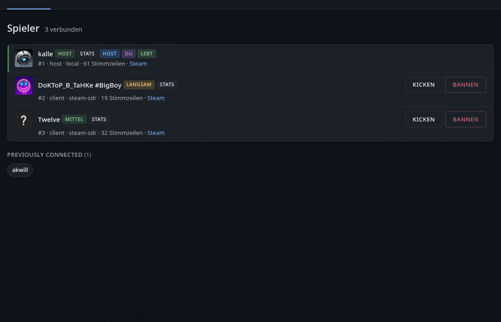
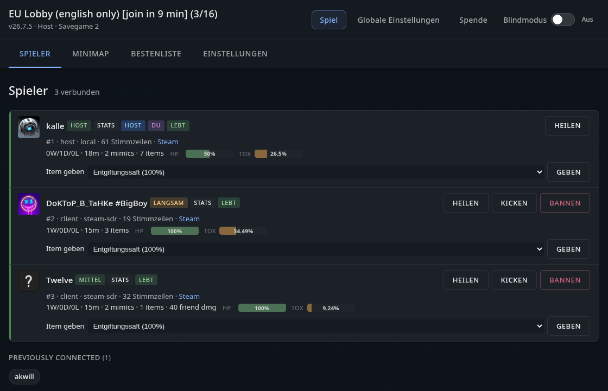

[](https://github.com/Kandru/mimesis-player-enhancements/releases/)
[](#license)
[](https://github.com/Kandru/mimesis-player-enhancements/issues)
[](https://www.paypal.com/donate/?hosted_button_id=C2AVYKGVP9TRG)

# Mimesis Player Enhancement


> [!NOTE]  
> Disclosure: this project is being build with help of AI!

> [!CAUTION]  
> **Alpha — under heavy development.** This plugin is not finished and things may not work as expected. Please report bugs and share feedback via [GitHub issues](https://github.com/Kandru/mimesis-player-enhancements/issues).  
> I am not responsible for any damage, data loss, bans, or other problems that come from using this mod. Mods change how the game runs, and things can break.

Mimesis Player Enhancement is a mod for Mimesis that consolidates and extends a lot of tweaks into one maintained package. Hosts can raise the player limits, expand mimic voice recording and persistence (across game sessions), allow players to join at any time, scale spawns/loot/money to match their needs, randomize dungeons, tune player and mimic behavior, control weather, and track session statistics — all from one config file. Clients do not need the mod; only the host does. It also replaces the save-game UI with a scrollable picker (up to 99 manual slots) and always shows the installed mod version in the main and in-game menus.

Tested with **MIMESIS 0.3.0** and **MelonLoader 0.7.3**.

## Features

Most features only need to be installed on the **host** — friends can join without the mod. See the **[User Manual](docs/wiki/README.md)** for detailed explanations of each feature and sub-feature.

| Feature | What it does | Who needs the mod? |
|---------|--------------|-------------------|
| [More Players](docs/wiki/features/more-players.md) | Play with larger groups beyond the four-player limit | Host only |
| [More Voices](docs/wiki/features/more-voices.md) | Let mimics remember many more player voice lines | Host only |
| [Persistence](docs/wiki/features/persistence.md) | Keep mimic voice recordings across gaming sessions | Host only |
| [Join Anytime](docs/wiki/features/join-anytime.md) | Let friends join after you've already started | Host only |
| [User Interface](docs/wiki/features/user-interface.md) | Extended save picker, HUD overlays, toast duration | Your game only |
| [Privacy](docs/wiki/features/privacy.md) | Block automatic telemetry, replay uploads, crash reports, and third-party SDK calls | Your game only |
| [Statistics](docs/wiki/features/statistics.md) | Track deaths, kills, play time, and more per save | Host only |
| [Web Dashboard](docs/wiki/features/web-dashboard.md) | Browser view for players, stats, settings, and moderation | Host only |
| [Player Announcements](docs/wiki/features/player-announcements.md) | On-screen tips for dungeon settings, bosses, and death stats | Host only |
| [Spawn Scaling](docs/wiki/features/spawn-scaling.md) | More or fewer enemies and traps in dungeons | Host only |
| [Loot Multiplicator](docs/wiki/features/loot-multiplicator.md) | More or less loot on the map | Host only |
| [Economy](docs/wiki/features/economy.md) | Adjust starting cash, scrap value, shop prices, and currency retention | Host only |
| [Dungeon Time](docs/wiki/features/dungeon-time.md) | Extra time inside the dungeon when you have more players | Host only |
| [Mimic Tuning](docs/wiki/features/mimic-tuning.md) | Tune mimic voice frequency, inventory copy, and possession timing | Host only |
| [Player Tuning](docs/wiki/features/player-tuning.md) | Change movement speed, stamina, and carry weight | Host only |
| [Dungeon Randomizer](docs/wiki/features/dungeon-randomizer.md) | Randomize which dungeons appear and how they are laid out | Host only |
| [Weather](docs/wiki/features/weather.md) | Fixed, cycling, or vanilla weather | Host only |

Inspired by community mods like [MorePlayers from NeoMimicry](https://github.com/NeoMimicry/MorePlayers), [MoreVoices from Risikus](https://thunderstore.io/c/mimesis/p/Risikus/More_Voices/), [MimesisPersistence from JoanR](https://github.com/JoanRLopez/MimesisPersistence), and [MimesisJoinAnytime from Shlygly](https://github.com/Shlygly/MimesisJoinAnytime). Thanks for your ideas and initial work :)

## Install

### Mod manager (recommended)

Install through [Thunderstore](https://thunderstore.io/c/mimesis/p/Kandru/MimesisPlayerEnhancement/) using **r2modman**, **Gale**, or another Thunderstore client. The MelonLoader dependency is pulled in automatically.

### Manual

1. Install the latest [MelonLoader](https://melonwiki.xyz/) on your MIMESIS Steam copy.
2. Download the [latest release](https://github.com/Kandru/mimesis-player-enhancements/releases).
3. Copy the file into your game folder:  
   `<Mimesis Steam folder>/Mods/MimesisPlayerEnhancement.dll`  
4. Start the game and open http://127.0.0.1:8001

If you used the old separate mods (MorePlayers, More Voices, MimesisPersistence, JoinAnytime, MoreMimics), remove them so they do not fight with this one or disable the feature inside this modification.

If you do not trust a pre-built `.dll`, you can [build this mod yourself](docs/BUILD.md) from the source code here on GitHub.

## Screenshot(s)

### Intuitive savegame UI


### Webinterface

#### Webinterface (Blind Mode on)


#### Webinterface (Blind Mode off)



## Config

After the first launch, the mod creates a config file here:

```
<Mimesis Steam folder>/UserData/MimesisPlayerEnhancement.cfg
```

You can edit it anytime. The game reloads the file while running; most settings apply immediately or on the next relevant game event (see [docs/CONFIG.md](docs/CONFIG.md) for apply timing). Unknown sections and keys from older mod versions are removed on load — they are not migrated.

Settings are grouped into TOML sections:

- **`[MimesisPlayerEnhancement]`** — global debug logging
- **`[MimesisPlayerEnhancement_Ui]`** — local UI preferences (save picker, spectator list, toast duration)
- **`[MimesisPlayerEnhancement_FeatureName]`** — one section per gameplay feature (e.g. `[MimesisPlayerEnhancement_MorePlayers]`)

Each gameplay feature section has its own master toggle plus feature-specific options. The web dashboard can edit global defaults and per-save-slot overrides; Web Dashboard listen settings are cfg-file only.

**Full config reference:** [docs/CONFIG.md](docs/CONFIG.md)

## Build from source

See [docs/BUILD.md](docs/BUILD.md).

## Contribute

1. [Fork](https://github.com/Kandru/mimesis-player-enhancements/fork) this repo on GitHub.
2. Create a branch for your change (`git checkout -b my-fix`).
3. Make your edits and run `./scripts/build.sh` to check it compiles (see [docs/DEVELOPMENT.md](docs/DEVELOPMENT.md) for build and formatting commands).
4. Push your branch and open a [pull request](https://github.com/Kandru/mimesis-player-enhancements/compare) against `main`.
5. Describe what you changed and why. Confirm `./scripts/build.sh` passes locally before opening the PR.

For architecture, feature scaffolding, and agent-oriented guidance, see [docs/DEVELOPMENT.md](docs/DEVELOPMENT.md) and [AGENTS.md](AGENTS.md).

Bug fixes and small improvements are welcome. For bigger features, open an issue first so we can agree on the approach.

## License

See [LICENSE](LICENSE). Persistence and More Players code derives from the original community mods — respect their licenses when sharing builds.
