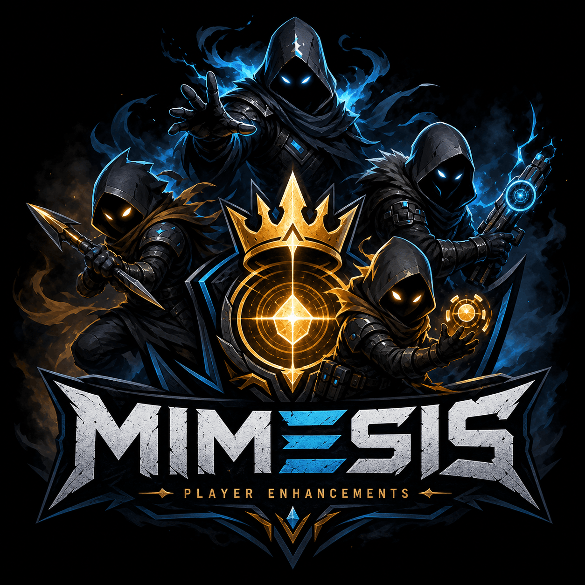
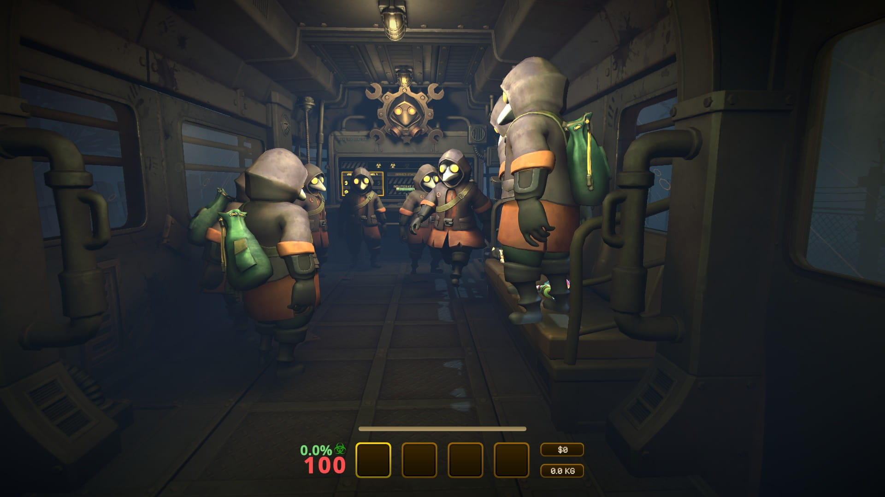
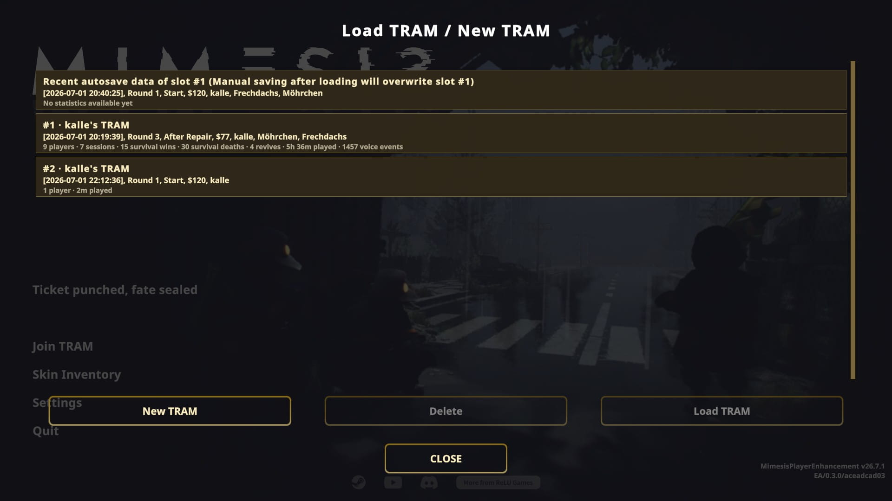
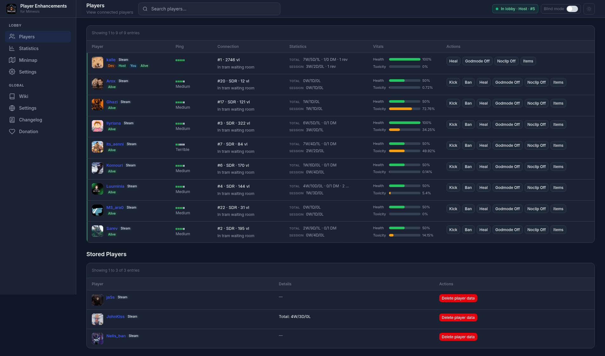
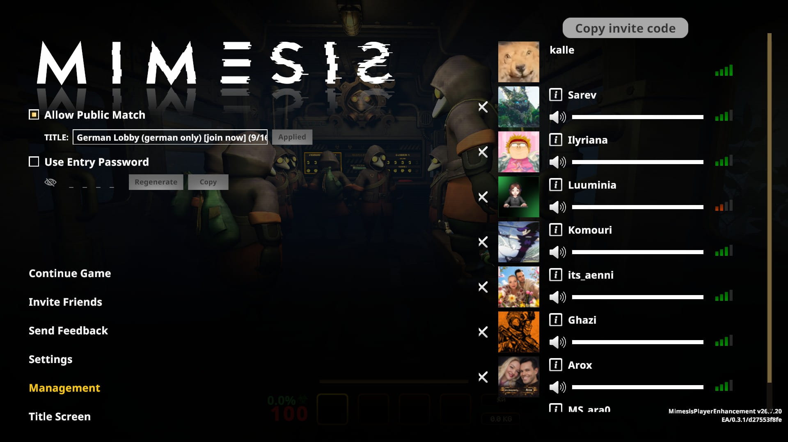
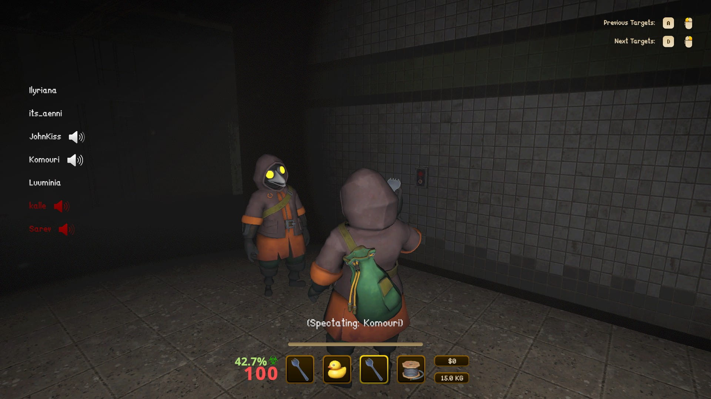

[](https://github.com/Kandru/mimesis-player-enhancements/releases/)
[](#license)
[](https://github.com/Kandru/mimesis-player-enhancements/issues)
[](https://www.paypal.com/donate/?hosted_button_id=C2AVYKGVP9TRG)

# Mimesis Player Enhancement



> [!NOTE]
> **AI-made extras.** Sounds, images, and screens in this mod were made with AI. They are **not** part of the base game. You can turn them off in the web dashboard.

> [!CAUTION]
> **Not a game bug?** Uninstall this mod (and other plugins), then test again **before** reporting to the developers. If the problem disappears, it was a mod.

> [!CAUTION]
> **Mod bugs?** Tell me via [GitHub issues](https://github.com/Kandru/mimesis-player-enhancements/issues).
> I am not responsible for damage, data loss, bans, or other problems. Mods change how the game runs, and things can break.

Host-side toolkit for **Mimesis**. Friends join as usual — **only the host needs the mod**.

Bigger lobbies (past 4 players), join between dungeon runs, and more mimic voices that persist across saves. Scale enemies, loot, money, and dungeon time with lobby size. Tune mimic replay/inventory/possession and player speed, stamina, and carry weight. Randomize dungeons, control weather, and start new saves with chosen cash, zone, and tram upgrades. Per-save stats and leaderboards. Optional privacy blocks for telemetry, replays, and crash reports.

On your PC: a savegame menu with up to 99 savegames, extra HUD (spectator list, damage numbers, FPS vitals), plus custom **tram disco-ball music** and **dungeon landing sounds**.

**Settings live in the web dashboard** (game must be running): [http://127.0.0.1:8001](http://127.0.0.1:8001)  
Lobby, live minimap, leaderboards, kick/ban, and every feature toggle — per save or globally. You can also edit the config file; most people never need to.

Tested with **MIMESIS 0.3.1** and **MelonLoader 0.7.3**.

## Features

See the **[Wiki](docs/wiki/README.md)** for details on each feature.

| Feature | In short | Who? |
|---------|----------|------|
| [More Players](docs/wiki/features/more-players.md) | Raise the 4-player cap (e.g. 32) | Host |
| [More Voices](docs/wiki/features/more-voices.md) | Mimics keep many more copied player lines | Host |
| [Persistence](docs/wiki/features/persistence.md) | Those recordings survive quit/reload | Host |
| [Join Anytime](docs/wiki/features/join-anytime.md) | Friends can join between dungeon runs | Host |
| [User Interface](docs/wiki/features/user-interface.md) | Savegame menu with up to 99 savegames, extra HUD | Your PC |
| [Custom Assets](docs/wiki/features/custom-assets.md) | Tram disco-ball music and dungeon landing sounds | Your PC |
| [Savegame Preparation](docs/wiki/features/savegame-preparation.md) | Starting cash, zone, and tram upgrades on new saves | Host |
| [Privacy](docs/wiki/features/privacy.md) | Block telemetry, replays, crash reports (off by default) | Your PC |
| [Statistics](docs/wiki/features/statistics.md) | Deaths, kills, play time, leaderboards per save | Host |
| [Web Dashboard](docs/wiki/features/web-dashboard.md) | Browser UI for players, map, stats, and settings | Host |
| [Spawn Scaling](docs/wiki/features/spawn-scaling.md) | More/fewer enemies and traps | Host |
| [Loot Multiplicator](docs/wiki/features/loot-multiplicator.md) | Scale map loot and enemy drops | Host |
| [Economy](docs/wiki/features/economy.md) | Starting cash, quota, scrap value, shop prices | Host |
| [Dungeon Time](docs/wiki/features/dungeon-time.md) | Extra clock time when the lobby is large | Host |
| [Mimic Tuning](docs/wiki/features/mimic-tuning.md) | Voice replay, decoy inventory, possession timing | Host |
| [Player Tuning](docs/wiki/features/player-tuning.md) | Speed, stamina, carry weight for the whole lobby | Host |
| [Dungeon Randomizer](docs/wiki/features/dungeon-randomizer.md) | Random dungeon, layout, variant, and seed | Host |
| [Weather](docs/wiki/features/weather.md) | Fixed, cycling, or vanilla; set start hour | Host |

**Host** — only the host needs the mod; joiners get the effect. **Your PC** — local client only; does not change the lobby for others.

Inspired by community mods like [MorePlayers from NeoMimicry](https://github.com/NeoMimicry/MorePlayers), [MoreVoices from Risikus](https://thunderstore.io/c/mimesis/p/Risikus/More_Voices/), [MimesisPersistence from JoanR](https://github.com/JoanRLopez/MimesisPersistence), and [MimesisJoinAnytime from Shlygly](https://github.com/Shlygly/MimesisJoinAnytime). Thanks for your ideas and initial work :)

## Install

### Mod manager (recommended)

Install through [Thunderstore](https://thunderstore.io/c/mimesis/p/Kandru/MimesisPlayerEnhancement/) using **r2modman**, **Gale**, or another Thunderstore client. The MelonLoader dependency is pulled in automatically.

### Manual

1. Install the latest [MelonLoader](https://melonwiki.xyz/) on your MIMESIS Steam copy.
2. Download the [latest release](https://github.com/Kandru/mimesis-player-enhancements/releases).
3. Copy the file into your game folder:  
   `<Mimesis Steam folder>/Mods/MimesisPlayerEnhancement.dll`  
4. Start the game and open http://127.0.0.1:8001

If you used the old separate mods (MorePlayers, More Voices, MimesisPersistence, JoinAnytime, MoreMimics), remove them so they do not fight with this one or disable the feature inside this modification.

If you do not trust a pre-built `.dll`, you can [build this mod yourself](docs/BUILD.md) from the source code here on GitHub.

## Screenshot(s)

### More Players



### Intuitive savegame UI



### Player Management (Webinterface)



### Escape Menu Player Management



### Advanced Spectator Death View



## Config

After the first launch, the mod creates a config file here:

```
<Mimesis Steam folder>/UserData/MimesisPlayerEnhancement.cfg
```

You can edit it anytime. The game reloads the file while running; most settings apply immediately or on the next relevant game event (see [docs/CONFIG.md](docs/CONFIG.md) for apply timing). Unknown sections and keys from older mod versions are removed on load — they are not migrated.

Settings are grouped into TOML sections:

- **`[MimesisPlayerEnhancement]`** — global debug logging
- **`[MimesisPlayerEnhancement_Ui]`** — local UI preferences (savegame menu, spectator list, toast duration)
- **`[MimesisPlayerEnhancement_FeatureName]`** — one section per gameplay feature (e.g. `[MimesisPlayerEnhancement_MorePlayers]`)

Each gameplay feature section has its own master toggle plus feature-specific options. The web dashboard can edit global defaults and per-save-slot overrides; Web Dashboard listen settings are cfg-file only.

**Full config reference:** [docs/CONFIG.md](docs/CONFIG.md)

## Build from source

See [docs/BUILD.md](docs/BUILD.md).

## Contribute

1. [Fork](https://github.com/Kandru/mimesis-player-enhancements/fork) this repo on GitHub.
2. Create a branch for your change (`git checkout -b my-fix`).
3. Make your edits and run `make debug` to check it compiles (see [docs/DEVELOPMENT.md](docs/DEVELOPMENT.md) for build and formatting commands).
4. Push your branch and open a [pull request](https://github.com/Kandru/mimesis-player-enhancements/compare) against `main`.
5. Describe what you changed and why. Confirm `make check` and `make debug` pass locally before opening the PR.

For architecture, feature scaffolding, and agent-oriented guidance, see [docs/DEVELOPMENT.md](docs/DEVELOPMENT.md) and [AGENTS.md](AGENTS.md).

Bug fixes and small improvements are welcome. For bigger features, open an issue first so we can agree on the approach.

## License

See [LICENSE](LICENSE). Persistence and More Players code derives from the original community mods — respect their licenses when sharing builds.
